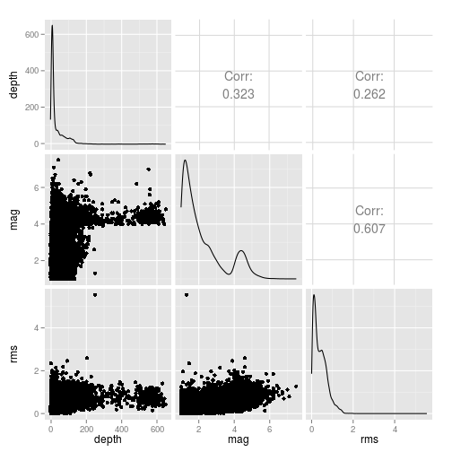
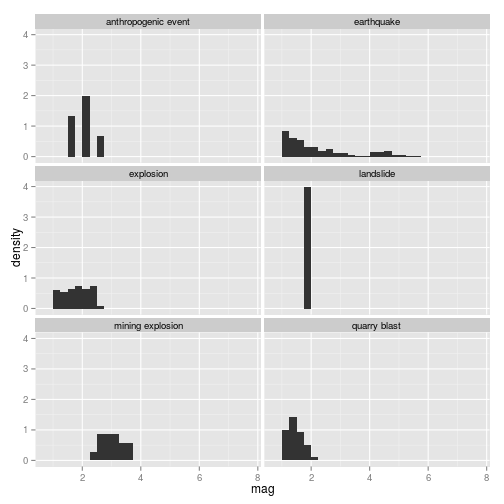
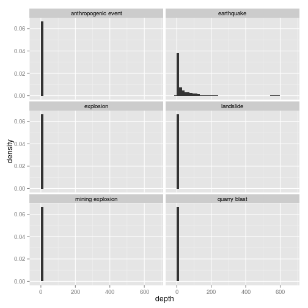
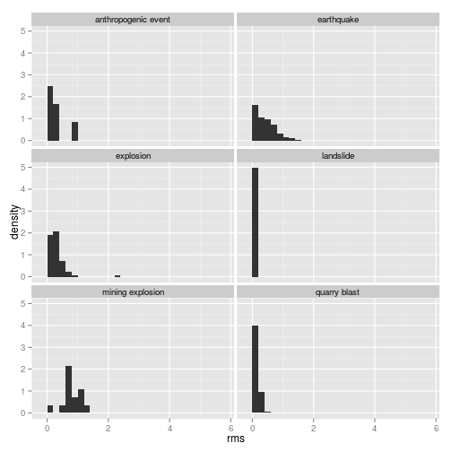
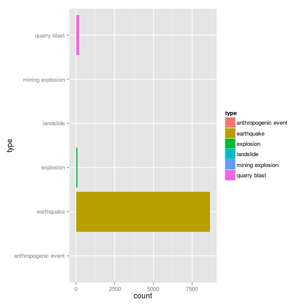
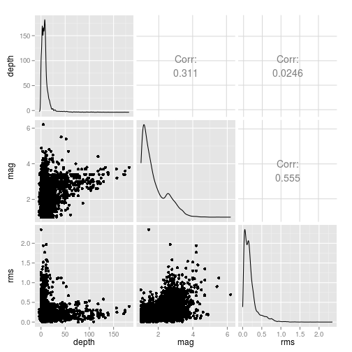
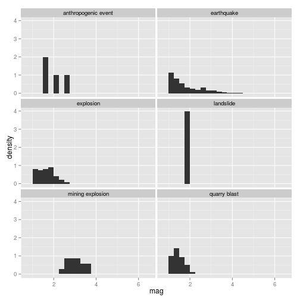
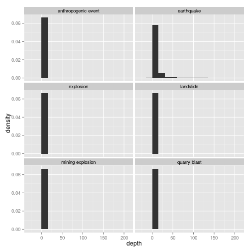
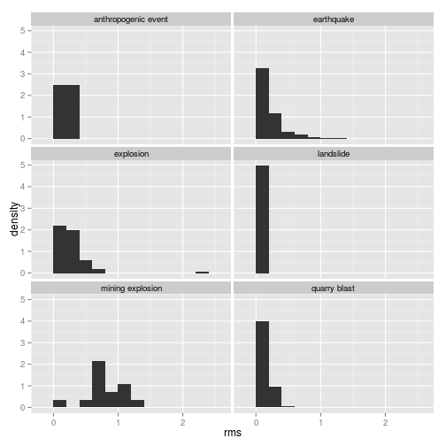

The purpose of this document is to explore a data set of $20,000$
seismic events obtained from the U.S. Geological Survey.


```r
library(dplyr, warn.conflicts = FALSE)
library(tidyr, , warn.conflicts = FALSE)
library(ggplot2)
library(GGally)
```

```
## 
## Attaching package: 'GGally'
## 
## The following object is masked from 'package:dplyr':
## 
##     nasa
```

```r
seismic <- read.csv("../seismic_data.csv")
dim(seismic)
```

```
## [1] 20000    15
```

```r
summary(seismic)
```

```
##                        time          latitude        longitude     
##  2015-01-24T07:05:38.000Z:    2   Min.   :-71.73   Min.   :-180.0  
##  2015-02-14T05:08:26.144Z:    2   1st Qu.: 34.23   1st Qu.:-150.5  
##  2015-02-15T03:15:34.700Z:    2   Median : 39.82   Median :-121.2  
##  2015-02-15T23:35:19.000Z:    2   Mean   : 39.67   Mean   :-100.7  
##  2015-03-06T14:22:59.500Z:    2   3rd Qu.: 59.97   3rd Qu.:-112.6  
##  2015-03-27T21:13:31.750Z:    2   Max.   : 87.09   Max.   : 180.0  
##  (Other)                 :19988                                    
##      depth              mag          magType           nst        
##  Min.   : -3.450   Min.   :1.00   ml     :11978   Min.   :  0.00  
##  1st Qu.:  5.445   1st Qu.:1.30   md     : 3130   1st Qu.:  8.00  
##  Median : 10.820   Median :1.72   mb     : 2900   Median : 16.00  
##  Mean   : 36.243   Mean   :2.19   Md     :  936   Mean   : 21.43  
##  3rd Qu.: 42.907   3rd Qu.:2.70   mb_lg  :  333   3rd Qu.: 29.00  
##  Max.   :649.740   Max.   :7.50   mc     :  230   Max.   :235.00  
##                                   (Other):  493   NA's   :10562   
##       gap             dmin             rms             net      
##  Min.   : 12.0   Min.   : 0.000   Min.   :0.000   ak     :6687  
##  1st Qu.: 64.0   1st Qu.: 0.046   1st Qu.:0.150   us     :4632  
##  Median : 99.0   Median : 0.141   Median :0.350   nc     :2612  
##  Mean   :120.1   Mean   : 1.083   Mean   :0.415   ci     :2110  
##  3rd Qu.:162.0   3rd Qu.: 0.720   3rd Qu.:0.610   nn     :1720  
##  Max.   :357.7   Max.   :55.070   Max.   :5.550   hv     : 620  
##  NA's   :5891    NA's   :7997     NA's   :98      (Other):1619  
##           id                            updated     
##  ak11480322:    1   2015-04-10T18:56:28.040Z:   48  
##  ak11480325:    1   2015-04-10T18:56:35.040Z:   45  
##  ak11480330:    1   2015-04-10T18:56:37.040Z:   44  
##  ak11480351:    1   2015-04-10T18:56:27.040Z:   43  
##  ak11480353:    1   2015-04-10T18:56:29.040Z:   42  
##  ak11480357:    1   2015-04-10T18:56:33.040Z:   41  
##  (Other)   :19994   (Other)                 :19737  
##                                place                        type      
##  68km ESE of Lakeview, Oregon     :  371   anthropogenic event:    6  
##  69km ESE of Lakeview, Oregon     :  240   earthquake         :19654  
##  67km ESE of Lakeview, Oregon     :  185   explosion          :  116  
##  6km NW of The Geysers, California:  106   landslide          :    1  
##  13km SE of Anza, California      :   78   mining explosion   :   14  
##  66km ESE of Lakeview, Oregon     :   72   quarry blast       :  209  
##  (Other)                          :18948
```

Definitions of these terms can be found
[here](http://earthquake.usgs.gov/earthquakes/feed/v1.0/glossary.php).

Several of these variable describe the measurements and not the
seismic event, so we'll reduce the data set.


```r
seismic <- seismic %>%
    select(-magType, -nst, -gap, -dmin, -net, -updated) %>%
    mutate(type = factor(type))
numeric.cols <- sapply(seismic, function(col) is.numeric(col))
numeric.cols[2:3] <- FALSE
cor(na.omit(seismic[numeric.cols]))
```

```
##           depth       mag       rms
## depth 1.0000000 0.3221792 0.2623305
## mag   0.3221792 1.0000000 0.6071473
## rms   0.2623305 0.6071473 1.0000000
```

```r
ggplot(seismic, aes(x = type, fill = type)) + geom_bar() +
    coord_flip()
```

 

We can see that the vast majority of events are earthquakes. Let's
take a look at any relationships between our variables.


```r
ggpairs(seismic[, numeric.cols])
```

 

```r
ggplot(seismic, aes(x = mag)) +
    geom_histogram(aes(y = ..density..), binwidth = 0.25) +
    facet_wrap(~type, ncol = 2)
```

 

```r
ggplot(seismic, aes(x = depth)) +
    geom_histogram(aes(y = ..density..), binwidth = 15) +
    facet_wrap(~type, ncol = 2)
```

 

```r
ggplot(seismic, aes(x = rms)) +
    geom_histogram(aes(y = ..density..), binwidth = 0.2) +
    facet_wrap(~type, ncol = 2)
```

 

The overwhelming number of earthquakes is making it difficult to
examine the properties of our other variable types. One option would
be to examine the other types without the earthquakes.  This, however,
might be too drastic in that we won't be able to find relationships
between earthquakes and our other variables.

By mapping the data, a more interesting solution presents itself.  It
looks like the only place where the reporting networks gave us
non-earthquake events is in the continental United States.  If we want
to find relationships between the event types, it might be wise to
restrict our sample to only those events which occurred in this
region.


```r
seismic <- seismic %>%
    filter(latitude < 49,
           latitude > 18,
           longitude < -63.37,
           longitude > -124.6) %>%
    mutate(type = factor(type))
summary(seismic)
```

```
##                        time         latitude       longitude      
##  2015-02-14T05:08:26.144Z:   2   Min.   :18.00   Min.   :-124.59  
##  2015-03-27T21:13:31.750Z:   2   1st Qu.:35.12   1st Qu.:-120.62  
##  2015-01-06T18:10:40.210Z:   1   Median :37.36   Median :-118.38  
##  2015-01-06T18:27:16.600Z:   1   Mean   :37.04   Mean   :-113.04  
##  2015-01-06T18:28:04.200Z:   1   3rd Qu.:40.23   3rd Qu.:-114.51  
##  2015-01-06T18:29:22.500Z:   1   Max.   :49.00   Max.   : -63.58  
##  (Other)                 :8945                                    
##      depth              mag             rms                  id      
##  Min.   : -3.450   Min.   :1.000   Min.   :0.0000   ci37097367:   1  
##  1st Qu.:  3.190   1st Qu.:1.210   1st Qu.:0.0800   ci37097415:   1  
##  Median :  6.750   Median :1.520   Median :0.1500   ci37097423:   1  
##  Mean   :  9.079   Mean   :1.756   Mean   :0.1975   ci37097455:   1  
##  3rd Qu.:  9.870   3rd Qu.:2.170   3rd Qu.:0.2400   ci37097471:   1  
##  Max.   :182.000   Max.   :6.200   Max.   :2.3500   ci37097527:   1  
##                                    NA's   :94       (Other)   :8947  
##                                place                       type     
##  68km ESE of Lakeview, Oregon     : 371   anthropogenic event:   4  
##  69km ESE of Lakeview, Oregon     : 240   earthquake         :8637  
##  67km ESE of Lakeview, Oregon     : 185   explosion          :  88  
##  6km NW of The Geysers, California: 106   landslide          :   1  
##  13km SE of Anza, California      :  78   mining explosion   :  14  
##  66km ESE of Lakeview, Oregon     :  72   quarry blast       : 209  
##  (Other)                          :7901
```

```r
numeric.cols <- sapply(seismic, function(col) is.numeric(col))
numeric.cols[2:3] <- FALSE
cor(na.omit(seismic[numeric.cols]))
```

```
##            depth       mag        rms
## depth 1.00000000 0.3121878 0.02460666
## mag   0.31218782 1.0000000 0.55488625
## rms   0.02460666 0.5548863 1.00000000
```


```r
ggplot(seismic, aes(x = type, fill = type)) + geom_bar() +
    coord_flip()
```

 

While we still mostly have earthquakes, we do see a higher proportion
of other events.

Now that we've restricted our sample, we can try the graphs again.


```r
ggpairs(seismic[, numeric.cols])
```

 

```r
ggplot(seismic, aes(x = mag)) +
    geom_histogram(aes(y = ..density..), binwidth = 0.25) +
    facet_wrap(~type, ncol = 2)
```

 

```r
ggplot(seismic, aes(x = depth)) +
    geom_histogram(aes(y = ..density..), binwidth = 15) +
    facet_wrap(~type, ncol = 2)
```

 

```r
ggplot(seismic, aes(x = rms)) +
    geom_histogram(aes(y = ..density..), binwidth = 0.2) +
    facet_wrap(~type, ncol = 2)
```

 

We certainly see more of the variability in our variables with this
restricted sample. For tasks like predicting an event type, this will
be essential.


