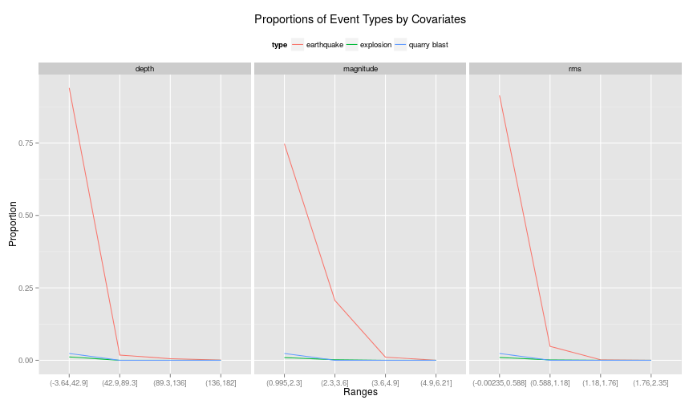
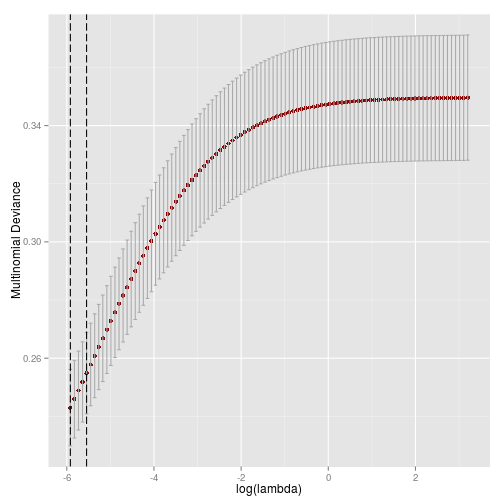
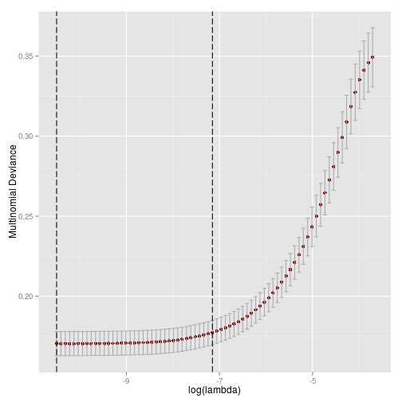
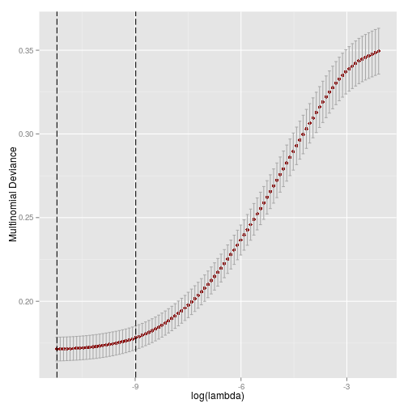
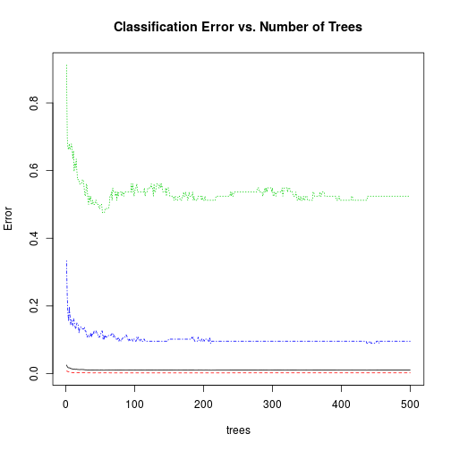

For this document, I will be focusing on predicing the type of seismic
event based on the other variables in the USGS data set.

As in the EDA, only variables which measure the events themselves will
be used.  Additionally, we will restrict our sample to events
occurring within the continental United States.

# Data shaping
## Subsetting and Clean-Up

```r
library(dplyr, warn.conflicts = FALSE)
library(tidyr, , warn.conflicts = FALSE)
library(ggplot2)
seismic <- read.csv("seismic_data.csv")
seismic <- seismic %>%
    dplyr::select(-magType, -nst, -gap, -dmin, -net, -updated) %>%
        mutate(type = factor(type)) %>%
            filter(latitude < 49,
                   latitude > 18,
                   longitude < -63.37,
                   longitude > -124.6) %>%
    dplyr::select(type, mag, depth, rms) %>%
    na.omit()
summary(seismic)
```

```
##                   type           mag            depth        
##  anthropogenic event:   4   Min.   :1.000   Min.   : -3.450  
##  earthquake         :8546   1st Qu.:1.210   1st Qu.:  3.180  
##  explosion          :  85   Median :1.520   Median :  6.727  
##  landslide          :   1   Mean   :1.759   Mean   :  9.063  
##  mining explosion   :  14   3rd Qu.:2.185   3rd Qu.:  9.810  
##  quarry blast       : 209   Max.   :6.200   Max.   :182.000  
##       rms        
##  Min.   :0.0000  
##  1st Qu.:0.0800  
##  Median :0.1500  
##  Mean   :0.1975  
##  3rd Qu.:0.2400  
##  Max.   :2.3500
```
Notice that we have only one landslide, which means we won't be able
to train a multinomial model to predict it and still have one in the
testing set, so we should remove the observation.

Additionally, we have some very small cells, which also tends to cause
problems in multinomial prediction problems. Because of this, we'll
collapse mining explosions and anthropogenic events into the
explosions class (operating under the assumption that the anthropenic
events are explosions).


```r
seismic <- seismic %>% filter(type != "landslide") %>%
    mutate(type = factor(type))
seismic$type <- factor(ifelse(seismic$type == "anthropogenic event" |
                              seismic$type == "mining explosion",
                              "explosion", as.character(seismic$type)))
seismic %>% dplyr::select(type) %>% summary()
```

```
##            type     
##  earthquake  :8546  
##  explosion   : 103  
##  quarry blast: 209
```

As a reminder, definitions of the covariates can be found
[here](http://earthquake.usgs.gov/earthquakes/feed/v1.0/glossary.php).


## Preliminary Analysis
To start, let's examine the proportions of each event by each of our covariates.

```r
prop.tab.mag <- with(seismic,
                     data.frame(prop.table(table(type, cut(mag, 4)))))
prop.tab.depth <- with(seismic,
                       data.frame(prop.table(table(type, cut(depth, 4)))))
prop.tab.rms <- with(seismic,
                     data.frame(prop.table(table(type, cut(rms, 4)))))
prop.tab <- data.frame(rbind(prop.tab.mag, prop.tab.depth,
                             prop.tab.rms),
                       var = rep(c("magnitude", "depth", "rms"),
                                 each = 12))
colnames(prop.tab) <- c("type", "range", "prop", "var")
ggplot(prop.tab, aes(x=range, y=prop, color=type, group=type)) +
    geom_line() + facet_wrap(~var, ncol = 3, scale = "free_x") +
    xlab("Ranges") + ylab("Proportion") +
    ggtitle("Proportions of Event Types by Covariates") +
    theme(legend.position = "top")
```

 

From these plots, we can see that predicting is going to be
difficult. Almost all events are low-magnitude, surface level
earthquakes which had well-predicted velocities.

Explosions and quarry plots have some differerence at the low end of
the scales, but differentating between them becomes more difficult as
we increase all three measures.

## Creating the Testing and Training Sets
From here we scale and center our variables and set up a training and
testing sets.  Note because of the diproportionate number of events,
we'll go with a stratified approach over a simple random sample of
rows, otherwise we might end up with a training set composed entirely
of earthquakes.  Because some of the `R` packages don't accept model
formulas, we also need to split up each set into the response and the
features.


```r
seismic[, -1] <- scale(seismic[, -1])
set.seed(100)
sampl <-  c(
    (data.frame(which(seismic$type == "earthquake")) %>%
        sample_frac(0.8))[,1],
    (data.frame(which(seismic$type == "explosion")) %>%
        sample_frac(0.8))[,1],
    (data.frame(which(seismic$type == "quarry blast")) %>%
        sample_frac(0.8))[,1])
seismic.train <- seismic[sampl,]
seismic.test <- seismic[-sampl,]
x.train <- as.matrix(seismic.train[,-1])
y.train <- seismic.train[,1]
x.test <- as.matrix(seismic.test[,-1])
y.test <- seismic.test[,1]
```

# Modelling
## Multinomial Regression
As a baseline, we'll start with basic multinomial logit model.

```r
library(nnet)
(seismic.multinom <- multinom(type ~ depth + mag + rms, seismic.train))
```

```
## # weights:  15 (8 variable)
## initial  value 7784.766678 
## iter  10 value 687.759231
## iter  20 value 600.728069
## final  value 600.586206 
## converged
```

```
## Call:
## multinom(formula = type ~ depth + mag + rms, data = seismic.train)
## 
## Coefficients:
##              (Intercept)     depth        mag        rms
## explosion      -15.62139 -19.74072  0.1548999  0.5176571
## quarry blast   -18.63146 -24.75921 -0.5934056 -0.8815323
## 
## Residual Deviance: 1201.172 
## AIC: 1217.172
```

We see that, for both explosions and quarry blasts, depth decreases
the likelihood of that type occuring.

Because we have so many low magnitude earthquakes (as per the
[Gutenberg–Richter law](http://en.wikipedia.org/wiki/Gutenberg%E2%80%93Richter_law)),
increasing the magnitude actually increases the chance of an event
being an explosion.  It also appears that the velocities of explosions
are harder to estimate, so a higher `rms` is also associated with
explosions.

Both relationships in explosions are reversed for quarry
blast's. Increasing the magnitude and the `rms` decrease the
likelihood of an event being a quarry blast over an earthquake.

Let's see how the predictions panned out.


```r
library(caret, warn.conflicts = FALSE)
```

```
## Loading required package: lattice
```

```r
library(e1071)
multinom.pred <- predict(seismic.multinom, newdata = seismic.test, type = "class")
err <- confusionMatrix(multinom.pred, y.test)
err$table
```

```
##               Reference
## Prediction     earthquake explosion quarry blast
##   earthquake         1704        18           42
##   explosion             1         3            0
##   quarry blast          4         0            0
```

```r
err$overall["Accuracy"]
```

```
##  Accuracy 
## 0.9633183
```

The multinomial model only miss-classified five out of 1709
earthquakes in the testing set.

The other event types where less successful, however.  Eighteen of
twenty-one explosions and all quarry blasts
were miss-classified as earthquakes.  On the positive side, the model
never confused these event types.

The overall classification accuracy was
$96.33\%$.
This may seem like a relatively good measure until we consider that
would get an accuracy 
rate of $96.44\%$
if we simply guess that every event is an earthquake
(i.e., $1709$ earthquakes $\div 1772$
total events = $0.9644$).

## Regularization Methods
Since the multinomial logit model did more poorly than simply guessing
that every event is an earthquake, we may want to see if a
regularization method can do better.

These methods are typically used with highly correlated covariates
(e.g., the lasso) or in high-dimensional space (e.g., ridge
regression). While we have neither  problem here, biasing
our covariance matrix may still lead to more accurate classification.

First, we'll create a prettier plot for examining the $\lambda$ values
against the fit.


```r
ggnet <- function(x){
    cv.obj <- x
    dat <- data.frame(lambda = cv.obj$lambda, dev = cv.obj$cvm,
                      ymax = cv.obj$cvup, ymin = cv.obj$cvlo)
    xints <- log(c(cv.obj$lambda.min, cv.obj$lambda.1se))
    ggplot(dat, aes(x = log(lambda), y = dev)) +
        geom_point(color = "darkred") +
        geom_errorbar(aes(ymax = ymax, ymin= ymin), color = "darkgrey") +
        geom_vline(xintercept = xints, linetype = "longdash") +
        ylab("Multinomial Deviance")
}
```

### Multinomial Ridge Regression
To start, we'll apply a ridge penalty to the model, which is
equivalent to an elastic net with $\alpha = 0$.


```r
library(glmnet, warn.conflicts = FALSE)
```

```
## Loading required package: Matrix
## 
## Attaching package: 'Matrix'
## 
## The following object is masked from 'package:tidyr':
## 
##     expand
## 
## Loading required package: foreach
## foreach: simple, scalable parallel programming from Revolution Analytics
## Use Revolution R for scalability, fault tolerance and more.
## http://www.revolutionanalytics.com
## Loaded glmnet 2.0-2
```

```r
library(doMC, warn.conflicts = FALSE)
```

```
## Loading required package: iterators
## Loading required package: parallel
```

```r
registerDoMC(cores = 6)
seismic.ridge <- cv.glmnet(x.train, y.train, family = "multinomial",
                           alpha = 0, parallel = TRUE)
seismic.ridge$lambda.1se
```

```
## [1] 0.003903322
```

```r
ggnet(seismic.ridge)
```

 

We can see the deviance increases rapidly as we increase $\lambda$,
suggesting that the ridge penalty isn't doing much for the fit
this data set.


```r
ridge.pred <- factor(predict(seismic.ridge, newx = x.test, type = "class"))
levels(ridge.pred) <- levels(y.test)
err.ridge <- confusionMatrix(ridge.pred, y.test)
err.ridge$table
```

```
##               Reference
## Prediction     earthquake explosion quarry blast
##   earthquake         1709        21           42
##   explosion             0         0            0
##   quarry blast          0         0            0
```

```r
err.ridge$overall["Accuracy"]
```

```
## Accuracy 
## 0.964447
```

While the multinomial GLM saw a decrease in its accuracy because it
incorrectly classified more earthquakes than correctly classified the
other types, the ridge model simply failed to distinguish between the
event types.

### Lasso
Instead of using a ridge penalty, we might try a lasso penalty
(equivalent to the elastic net with $\alpha = 1$.

```r
seismic.lasso <- cv.glmnet(x.train, y.train, family = "multinomial",
                           alpha = 1, parallel = TRUE)
seismic.lasso$lambda.1se
```

```
## [1] 0.0007842683
```

```r
ggnet(seismic.lasso)
```

 

As with the ridge model, the lasso model performs best with minimal
shrinkage, though the fit worsens more slowly than in the ridge model.


```r
lasso.pred <- factor(predict(seismic.lasso, newx = x.test, type = "class"))
err.lasso <- confusionMatrix(lasso.pred, y.test)
err.lasso$table
```

```
##               Reference
## Prediction     earthquake explosion quarry blast
##   earthquake         1705        19           42
##   explosion             1         2            0
##   quarry blast          3         0            0
```

```r
err.lasso$overall["Accuracy"]
```

```
##  Accuracy 
## 0.9633183
```

In contrast to the ridge model, however, the lasso model does make
some attempt at distinguishing events, correctly identifying two
explosions.  Unfortunately, this comes at a cost of miss-classifying
four of the earthquakes.

### Elastic Net
Neither of the extremes of the regularization methods worked
particularly well, notice that the ridge penalty lead to all
earthquake predictions and the lasso penalty to miss-classifying
more earthquakes than properly identifying explosions or quarry
blasts.

A compromise between the lasso and ridge models may strike a decent
compromise. Because we now have two hyperparameters to optimize, we
need to look beyond `cv.glmnet()` to fit the model and turn to the
`train()` function from the `caret` package.

Because the `train` object isn't compatible with some of the other
prediction and plotting functions already used, we'll need to refit
the model using `glmnet`.


```r
e.grid <- expand.grid(.alpha = (1:10)*(0.1), .lambda = 20^(-5:1))
seeds <- lapply(1:50, function(i) sample.int(1000, 10))
seeds <- append(seeds, sample.int(1000, 1))
cntrl <- trainControl(method = "adaptive_cv",
                      repeats = 5,
                      seeds = seeds,
                      allowParallel = TRUE)
seismic.train <- train(x.train, y = y.train,
                       method = "glmnet",
                       family = "multinomial",
                       tuneGrid = e.grid,                      
                       trControl = cntrl)
(params <- seismic.train$bestTune)
```

```
##   alpha lambda
## 9   0.2 0.0025
```

```r
seismic.enet <- cv.glmnet(x.train, y.train, family = "multinomial",
                           alpha = params["alpha"], parallel = TRUE)
ggnet(seismic.enet)
```

 

So with our mixing parameter, we're splitting the difference between
ridge regression and the lasso.


```r
enet.pred <- factor(predict(seismic.enet, newx = x.test, type = "class"))
err.enet <- confusionMatrix(enet.pred, y.test)
err.enet$table
```

```
##               Reference
## Prediction     earthquake explosion quarry blast
##   earthquake         1705        19           42
##   explosion             1         2            0
##   quarry blast          3         0            0
```

```r
err.enet$overall["Accuracy"]
```

```
##  Accuracy 
## 0.9633183
```

Unfortunately, we see the same results as in the lasso. We do manage
to correctly predict two explosions, but at the cost of missing the
classification of four earthquakes, leaving us with a lower accuracy
rate than ridge regression.

## Random Forest

```r
library(randomForest)
```

```
## randomForest 4.6-10
## Type rfNews() to see new features/changes/bug fixes.
## 
## Attaching package: 'randomForest'
## 
## The following object is masked from 'package:dplyr':
## 
##     combine
```

```r
seismic.rf <- randomForest(x.train, y.train)
plot(seismic.rf, main = "Classification Error vs. Number of Trees")
```

 

The random forest has the most trouble classifying quarry blasts (the
green line in the classification error plot), doesn't a decent job
with explosions, and performs quite well with earthquakes.


```r
rf.pred <- predict(seismic.rf, newdata = seismic.test, type = "class")
err.rf <- confusionMatrix(rf.pred, y.test)
err.rf$table
```

```
##               Reference
## Prediction     earthquake explosion quarry blast
##   earthquake         1703         0            3
##   explosion             4        11            2
##   quarry blast          2        10           37
```

```r
err.rf$overall["Accuracy"]
```

```
## Accuracy 
## 0.988149
```

While we do see some miss-classifying of earthquakes, the random
forest does quite well overall. Thirty-seven of forty-two quarry
blasts are correctly identified, but about half of all explosions
are miss-classified.

Unlike the other models, however, the miss-classification of
explosions is restricted to quarry blasts instead of earthquakes.

The model boasts and accuracy rate of
$98.81\%$, a great improvement over
the other techniques.

## $k-$ Nearest Neighbors

```r
library(class)
knn.params <- tune.knn(x.train, y.train, k = 1:30, l = 0,
                       tune.control(sampling = "fix"),
                       validation.x = x.test,
                       validation.y = y.test)$best.parameters[1]
knn.pred <- knn(x.train, x.test, y.train, k = knn.params[1])
err.knn <- confusionMatrix(knn.pred, y.test)
err.knn$table
```

```
##               Reference
## Prediction     earthquake explosion quarry blast
##   earthquake         1706        20           27
##   explosion             0         0            0
##   quarry blast          3         1           15
```

```r
err.knn$overall["Accuracy"]
```

```
## Accuracy 
## 0.971219
```


Earthquakes were classified fairly well, with only three misses.

Classifying explosions was less than successful, with twenty of the
twenty one being misidentified as earthquakes

Quarry blasts fared better than the explosions, but twenty-seven events
of the forty-two were still classified as earthquakes.

While the performance of $k-$NN is not at the same level as the random
forest, we do better than the regularization based methods and the
multinomial logit.

## Support Vector Machine

```r
svm.params <- tune.svm(x.train, y.train,
                       tune.control(sampling = "fix"),
                       validation.x = x.test,
                       validation.y = y.test,
                       gamma = 10^(-7:-1),
                       cost = 10^(-1:1))$best.parameters
seismic.svm <- svm(x.train, y.train,
                   gamma = svm.params[1],
                   cost = svm.params[2])
svm.pred <- predict(seismic.svm, x.test)
err.svm <- confusionMatrix(svm.pred, y.test)
err.svm$table
```

```
##               Reference
## Prediction     earthquake explosion quarry blast
##   earthquake         1709        21           42
##   explosion             0         0            0
##   quarry blast          0         0            0
```

```r
err.svm$overall["Accuracy"]
```

```
## Accuracy 
## 0.964447
```

As with the multinomial ridge model, the best the support vector
machine could do with this data as simply classifying everything as an
earthquake. 

# Conclusions
Overall, this we see that his is a difficult classification problem
because of the huge imbalance in the counts of our event types.

The simpler models, like $k-$ NN, the random forest, and the
multinomial logit model, tend to perform better than the more complex
fits.

Of course, this was just meant as a chance to practice these models
and work on a fun problem. As I get the chance, I plan on exploring
weighting methods for the observations and spatial models.
